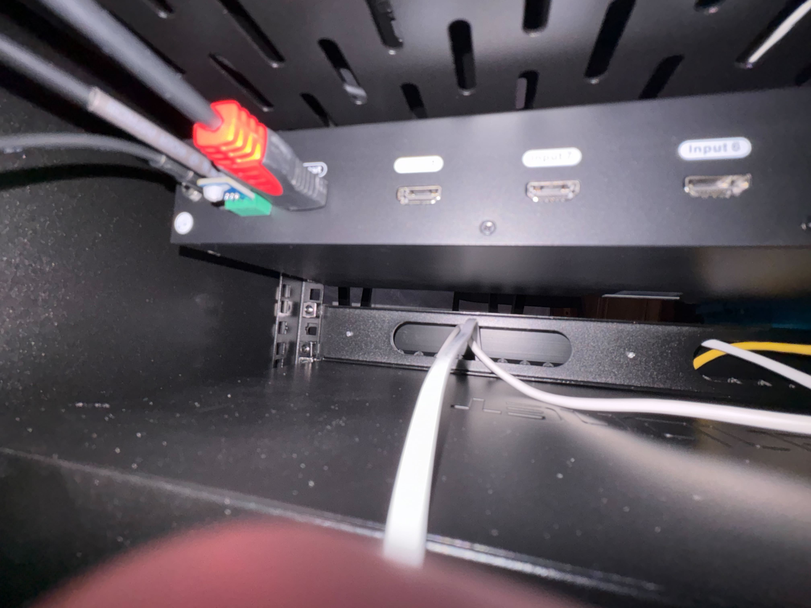

<style>
    .slide-title {
        color: #fff;
    }
    .red {
        color: #f00;
    }
    .slide-body {
        width: 100%;
        text-align: center;
        color: #fff;
    }

    .talk-title {
        position: absolute;
        width: 100%;
        top: 350px;
        left: 0;
        color: #fff;
    }
</style>>

<h1 class='talk-title'>Hacking My Home's Audio/Video</h1>

---

<style>
.name {
    position: absolute;
    top: 555px;
    left: 200px;
    color: #000;
}
.title {
    position: absolute;
    top: 200px;
    left: 780px;
}
.bio {
    position: absolute;
    top: 260px;
    left: 580px;
    width: 600px;
}
.image {
  position: absolute;
  top: 90px;
  left: 85px;
  height: 450px;
  box-shadow: 20px 20px 100px 100px white inset;
}
</style>


<div class='title'>Who Am I?</div>
<div class='bio'>
Software Consultant<br>
Pyowa Organizer<br>
~20 Years Web Dev<br>
~15 Years Python<br>
~15 Years Agile<br>
~20 Year Husband<br>
~10 Year Father<br>
~Lifelong Nerd<br>
</div>

<div class='name'>Matthew J. Morrison</div>


---

<div class="slide-body">
    <h1 class='slide-title'>Here's The Plan</h1>
    <ul class='ordered-list'>
        <li>Walk through my learning process with slides</li>
        <li>Hardware tour</li>
        <li>Software tour</li>
        <li>Live Demo</li>
    </ol>
</div>


---

<style>
    .ordered-list {
        text-align: left;
    }
</style>

<div class="slide-body">
    <h1 class='slide-title'>Here's The Setup</h1>
    <ol class='ordered-list'>
        <li>TV in Living Room</li>
        <li>HDMI Cable to basement</li>
        <li>All components in Basement</li>
    </ol>
</div>


---

<style>
.tv {
    float: left;
    height: 475px;
}
.smurf {
    margin-left: 120px;
    float: left;
    height: 500px;
}
</style>
<h1 class='slide-title'>Living Room</h1>


---


<style>
    .rack {
        height: 500px;
    }
    .switch-back {
        margin-left: 70px;
        height: 500px;
    }
</style>
<h1 class='slide-title'>Basement</h1>




---

<div class="slide-body">
    <h1 class='slide-title'>Hardware</h1>
    <ol class='ordered-list'>
        <li>HDMI Switch</li>
        <li>Raspberry Pi (Raspberry Pi OS)</li>
        <li>USB -> Serial Cable</li>
    </ol>
</div>

---

<style>
    .switch {
        height: 500px;
    }
</style>
<div class="slide-body">
    <h1 class='slide-title'>HDMI Switch - $189.99</h1>
    
</div>

---

<style>
    .pi {
        height: 500px;
    }
</style>
<div class="slide-body">
    <h1 class='slide-title'>Raspberry Pi 8GB Kit - $127.99</h1>
    
</div>

---

<style>
    .cable {
        height: 400px;
    }
</style>
<div class="slide-body">
    <h1 class="slide-title">USB to RS-232 3-pin Phoenix Serial Cable - $19.99<h1>
    
</div>

---

<div class="slide-body">
    <h1 class='slide-title'>Software</h1>
    <ol class='ordered-list'>
        <li>Python web app</li>
        <li>HTML/CSS/JavaScript</li>
        <li>Systemd Service</li>
    </ol>
</div>

---

<div class="slide-body">
    <h1 class='slide-title'>Disclaimer</h1>
    <ol class='ordered-list'>
        <li>I know very little about hardware</li>
        <li>This software all is all pre-alpha / proof of concept</li>
    </ol>
</div>

---
<style>
    .app {
        height: 500px;
    }
    .screenshot {
        float: left;
    }
    .features {
        float: right;
        text-align: left;
    }
</style>

<div class="slide-body">
    <h1 class="slide-title">Goal</h1>
    <div class='screenshot'>
        
    </div>
    <ul class='features'>
        <li>Show all components</li>
        <li>Highlight current selection on load</li>
        <li>Allow update of current selection</li>
    </ul>
</div>


---

<style>
    .list {
        text-align: left;
    }
</style>
<div class="slide-body">
    <h1 class="slide-title">Constraints</h1>
    <ul class="list">
        <li>Minimal dependencies</li>
        <li>Minimal number of files</li>
        <li>Simple Deploy</li>
        <li>Autostart on boot</li>
    </ul>
</div>


---

<div class="slide-body">
    <h1 class="slide-title">TESmart 8x1 HDMI Switch (KVM)</h1>
    <p>Technical Details</p>
</div>


---

<div class="slide-body">
    <h1>communication protocol</h1>
    <p>Baud rate: 9600 bps</p>
    <p>Stop bit: 1 bit</p>
    <p>Data length: 8 bits</p>
</div>

---


<div class="slide-body">
    <h1 class='slide-title'>Baud (from docs)</h1>

```
9600

```

<h2>WTF is baud?</h2>
<p>a unit of transmission speed equal to the number of times a signal changes state per second. One baud is equivalent to one bit per second.</p>

</div>

---

<div class="slide-body">
    <h1 class="slide-title">Switch Input Source</h1>
    <p>Switch to PC1: <code>0xAA 0xBB 0x03 0x01 <span class="red">0x01</span> 0xEE</code></p>
    <p>Switch to PC2: <code>0xAA 0xBB 0x03 0x01 <span class="red">0x02</span> 0xEE</code></p>
    <p>Switch to PC3: <code>0xAA 0xBB 0x03 0x01 <span class="red">0x03</span> 0xEE</code></p>
    <p>...</p>
</div>

---

<div class="slide-body">
    <h1 class="slide-title">Read current active input port</h1>

<code>0xAA 0xBB 0x03 0x10 0x00 0xEE</code>

<h2 class="slide-title">Feedback</h2>

<code>0xAA 0xBB 0x03 0x11 0xXX 0xEE</code>

<p>Note: <code>0xXX</code> indicates current active input port of the switch</p>


<p><code>0x00</code>->PC1, <code>0x01</code>->PC2, <code>0x02</code>->PC3...<code>0x07</code>->PC8</p>

</div>

---
<style>
    code {
        text-align: left;
    }
</style>

<div class="slide-body">
    <h1 class="slide-title">How do I do it?</h1>
    <h2>Python Package</h2>
    <code>pyserial</code>
</div>

---

<div class="slide-body">
    <h1 class="slide-title">How do I do it?</h1>

```
s = serial.Serial('device?', 'baud?', timeout=1)
s.write(b'...?')
response = s.read(size='size?')
```

</div>

---


<div class="slide-body">
<h1 class='slide-title'>What is my device called?</h1>

```python
>>> from serial.tools import list_ports
>>> for port in list_ports.comports():
...     print(port)
...
/dev/ttyUSB0 - USB Serial Converter - USB Serial Converter
```

</div>

---


<div class="slide-body">
    <h1 class='slide-title'>Hardware Tour</h1>
</div>

---


<div class="slide-body">
    <h1 class='slide-title'>Software Tour</h1>
</div>

---


<div class="slide-body">
    <h1 class='slide-title'>Live Demo</h1>
</div>

---


<style>
.exit-title {
    position: absolute;
    top: 200px;
    left: 760px;
}
.exit-name {
    position: absolute;
    top: 555px;
    left: 275px;
    color: #000;
}
.bluesky-qr-exit {
    position: absolute;
    height: 200px;
    left: 100px;;
    top: 105px;
}
.linkedin-qr-exit {
    position: absolute;
    height: 200px;
    top: 330px;
    left: 300px;
}
.github-qr-exit {
    position: absolute;
    height: 200px;
    top: 300px;
    right: 305px;
}
</style>


<div class='exit-name'>Contact Me</div>
<div class='exit-title'>Slides & Code</div>


