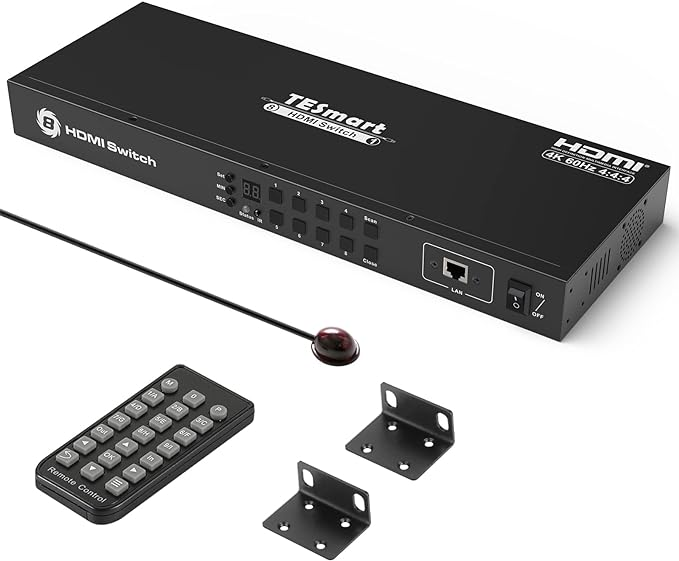
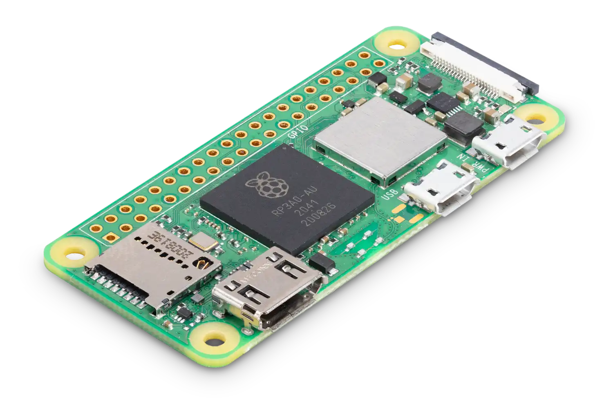
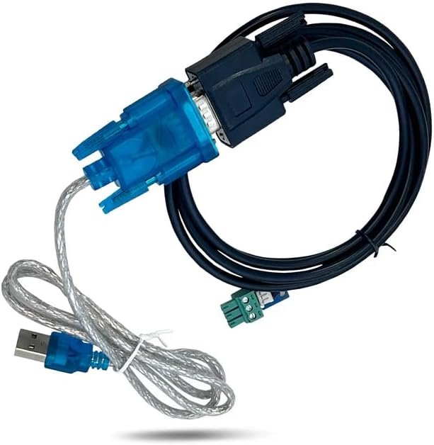
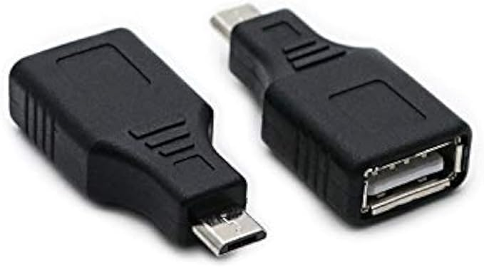
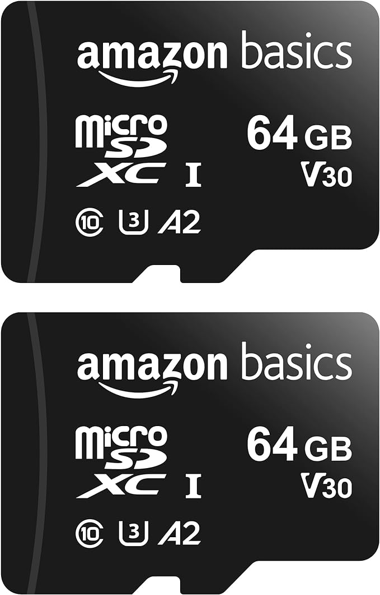
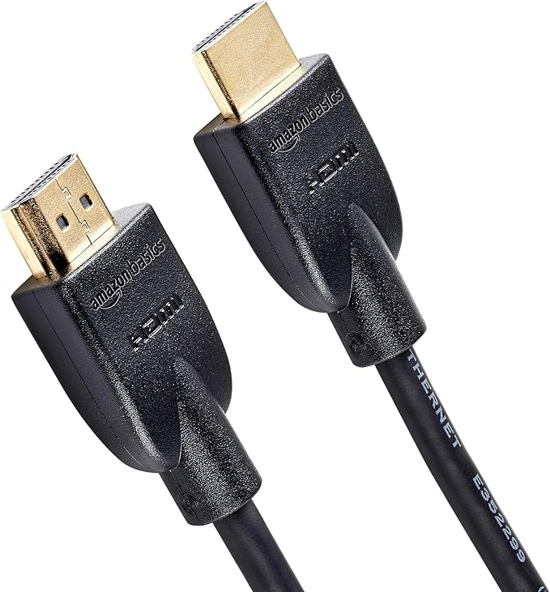

# Hardware 

## TESmart 8×1 HDMI Switch

## Raspberry Pi Zero 2 W

## USB to RS-232 3-pin Phoenix Serial Cable

## USB 2.0 Micro USB Male to Type A Female adapter

## Micro SD Card

## HDMI Cables

